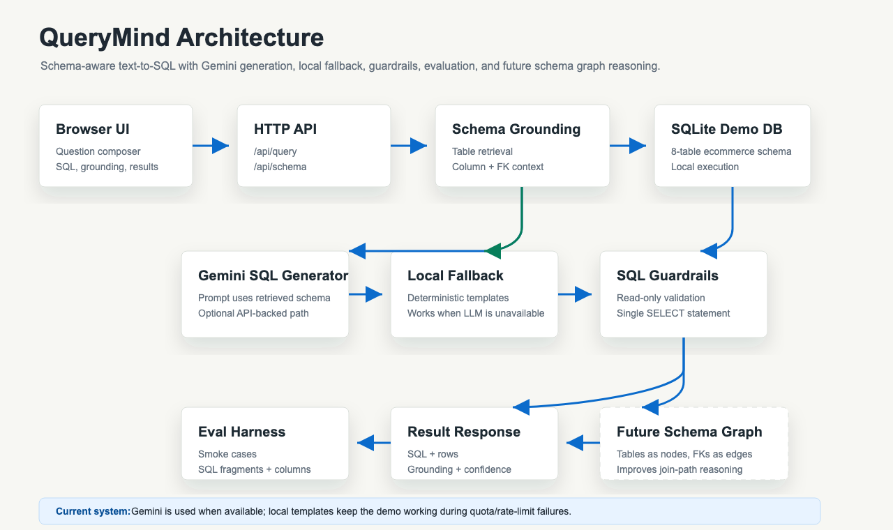

# QueryMind

QueryMind is a schema-aware text-to-SQL MVP that turns plain English analytics questions into executable SQL, explains which database tables were used for grounding, and runs the query against a local SQLite demo database.

The project focuses on the parts that matter in real AI engineering systems: schema understanding, safe SQL generation, fallback behavior, evaluation, and a demo UI that makes the reasoning visible.



## Why This Exists

Most text-to-SQL demos look impressive until they meet a real database schema.

The hard parts are not just “generate SQL.” The hard parts are:

- understanding which tables and columns are relevant
- avoiding hallucinated table names
- choosing valid join paths
- preventing unsafe SQL execution
- evaluating whether generated SQL is actually useful
- handling LLM failures, quota limits, and fallback paths

QueryMind makes those pieces visible.

The MVP started with deterministic SQL templates so the full system could run locally without an API key. It now supports an optional Gemini-backed generation path while preserving local fallback behavior.

## Features

- 8-table ecommerce SQLite schema with customers, products, orders, payments, refunds, shipments, and support tickets
- Schema introspection over table names, columns, foreign keys, and row counts
- Lightweight schema grounding to identify likely tables for each user question
- Optional Gemini-backed SQL generation using retrieved schema context
- Deterministic local fallback templates for common analytics questions
- Read-only SQL guardrails before execution
- Browser UI showing generated SQL, schema grounding, confidence, latency, and result rows
- Evaluation harness with smoke tests for generated SQL behavior

## Architecture

```text
User question
    ↓
Schema introspection
    ↓
Schema grounding / table retrieval
    ↓
LLM SQL generation, if enabled
    ↓
Local template fallback, if LLM is unavailable
    ↓
SQL guardrail validation
    ↓
SQLite execution
    ↓
Results + generated SQL + grounding explanation
```

## Quick Start

Create the demo database:

```bash
python3 scripts/init_demo_db.py
```

Run the app:

```bash
python3 -m app.main
```

Open:

```text
http://127.0.0.1:8000
```

Run tests:

```bash
python3 -m unittest discover -s tests
```

Run the eval suite:

```bash
python3 scripts/run_eval.py
```

## Optional Gemini Setup

QueryMind can use Gemini for SQL generation when an API key is available.

Set your environment variables:

```bash
export GEMINI_API_KEY="your_gemini_api_key_here"
export QUERYMIND_USE_LLM=true
export QUERYMIND_GEMINI_MODEL=gemini-1.5-flash
```

Then start the app:

```bash
python3 -m app.main
```

If Gemini is unavailable, rate-limited, or quota-exhausted, QueryMind falls back to the local deterministic generation path.

## Example Questions

```text
Show monthly revenue for completed orders
Which product categories generated the most revenue?
Who are the top 5 customers by spend?
How many orders do we have by status?
Which shipments are still in transit?
List customers in Seattle
List all the cities
Show open support tickets by priority
Show customers who opened high priority support tickets
```

## What Schema Grounding Means

Before generating SQL, QueryMind identifies which tables are most relevant to the user’s question.

For example:

```text
Who are the top 5 customers by spend?
```

Relevant tables may include:

```text
customers
orders
order_items
```

That grounding helps the SQL generator avoid hallucinated tables and focus on valid join paths.

Instead of blindly asking an LLM to generate SQL, QueryMind provides schema context such as:

```text
customers(customer_id, full_name, email, city, segment)
orders(order_id, customer_id, order_date, status)
order_items(order_item_id, order_id, product_id, quantity, unit_price_cents)
```

This makes the generated SQL more likely to match the real database.

## Context Engineering Direction

QueryMind is also evolving toward a context-engineered text-to-SQL agent.

In document RAG, context usually means retrieved documents. In QueryMind, context means:

```text
database schema
table names
column names
foreign keys
join paths
sample values
query history
execution errors
business definitions
```

The current MVP retrieves relevant tables before generating SQL. A stronger future version will let the system dynamically navigate context before answering.

For example:

```text
Question: Which customers had delayed shipments after high-value orders?

Context steps:
1. Inspect customer-related tables.
2. Find join path: customers → orders → shipments.
3. Check whether order value requires order_items.
4. Inspect shipment date/status columns.
5. Generate SQL.
6. Execute and repair if needed.
```

This moves QueryMind from static schema retrieval toward a context-aware SQL agent.

## Evaluation

Current MVP eval: `6/6` smoke cases passing locally.

The eval checks:

- expected SQL fragments
- expected output columns
- non-empty executable results

This is intentionally not presented as a full text-to-SQL benchmark yet. Future eval work should include paraphrase coverage, invalid-value filters, execution equivalence, larger schemas, and adversarial questions.

## How I Built This

The first version was designed to be honest and demoable.

Rather than immediately relying on an LLM for everything, I built the system around observable pieces:

1. Introspect the database schema.
2. Retrieve relevant tables for a natural language question.
3. Generate SQL through Gemini or deterministic fallback logic.
4. Validate that SQL is read-only and single-statement.
5. Execute locally against SQLite.
6. Return SQL, results, grounding, confidence, and latency.

This makes the LLM one part of the system, not the entire system.

## Project Structure

```text
querymind/
├── README.md
├── docs/
│   ├── architecture.svg
│   ├── architecture.png
│   └── demo-script.md
├── notebooks/
│   └── eval_results.ipynb
├── app/
│   ├── main.py
│   ├── querymind/
│   └── web/
├── data/
│   ├── demo_ecommerce.sql
│   └── eval_questions.json
├── scripts/
│   ├── init_demo_db.py
│   └── run_eval.py
├── tests/
└── launch/
```

## Current Limitations

- The demo database is small and local.
- Schema grounding is keyword-based, not embedding-based yet.
- LLM output quality depends on API availability and quota.
- SQL repair with execution feedback is not implemented yet.
- The eval suite is a smoke test, not a benchmark.

## Roadmap

- Improve Gemini-backed SQL generation prompts
- Add visible UI status for LLM vs local fallback generation
- Add embedding-based schema retrieval for larger schemas
- Add schema graph view where tables are nodes and foreign keys are edges
- Use schema graph paths to improve join selection for generated SQL
- Add context engineering layer for dynamic schema, join-path, sample-value, and execution-error navigation
- Store successful query patterns and failed-query repairs so context improves with usage
- Add automatic schema refresh so table and column context stays up to date
- Add PostgreSQL connector
- Add SQL repair loop with execution feedback
- Add benchmark-style evals and execution equivalence scoring
- Record `docs/demo.gif` for the public README

## Future Direction: Schema Graph

A strong next milestone is a schema graph.

In this view:

```text
customers → orders → order_items → products
orders → payments
orders → shipments
orders → refunds
customers → support_tickets
```

Tables become nodes, and foreign keys become edges.

This can help QueryMind explain why it selected a join path and can later improve LLM prompting by giving the model relationship-aware schema context.

## GitHub Topics

`nlp` `text-to-sql` `llm` `rag` `sqlite` `gemini` `ai-engineering` `sql`